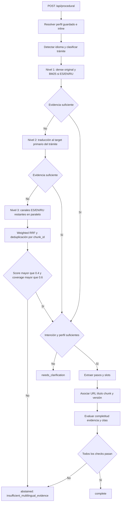

# Arquitectura de recomendaciones procedimentales

## Objetivo

El módulo transforma evidencia recuperada en instrucciones procedimentales personalizadas y trazables. No sustituye asesoría legal ni presume que una fuente hardcoded o cacheada esté vigente: si faltan datos del usuario solicita aclaración; si faltan datos oficiales se abstiene.

## Flujo



La adquisición externa no se activa en este endpoint. El fallback multilingüe se agota antes de devolver abstención; una integración futura podrá reutilizar la adquisición transaccional después del nivel 4.

## Retrieval multilingüe adaptativo

El routing usa el tipo de trámite, nunca la región o nacionalidad del usuario:

| Tipo | Target primario | Motivo |
|---|---|---|
| visa, registro, migración | `ru` | Las fuentes normativas principales son МВД, ГУВМ МВД y Госуслуги. |
| matrícula, vivienda | `es` | El corpus KubGU y las guías de adaptación contienen secciones en español. |
| ambiguo/other | `en` | Inglés funciona como fallback internacional, sin convertirlo en evidencia suficiente por sí mismo. |

### Canales y pesos iniciales

| Canal | Peso | Activación |
|---|---:|---|
| `dense_original` | 1.0 | Siempre que dense esté disponible. |
| `bm25_original` | 0.8 | Solo para consultas originales ES/EN/RU. |
| `dense_ru_translated` | 0.9 | Traducción prioritaria o fallback hacia ruso. |
| `dense_es_translated` | 0.6 | Evidencia secundaria en español. |
| `dense_en_translated` | 0.6 | Evidencia secundaria internacional. |

Los pesos son iniciales y deben calibrarse en el benchmark procedural separado. No proceden de B3. `best-score` no se usa en producción porque BM25, coseno y RRF tienen escalas distintas.

### Weighted RRF

Cada canal aporta como máximo una vez por `chunk_id`:

$$
\operatorname{score}(d)=\sum_{c \in C_d}\frac{w_c}{k+\operatorname{rank}_c(d)},\qquad k=60
$$

La salida conserva por canal el rango, peso, contribución y score bruto solo como telemetría. El orden fusionado usa exclusivamente weighted RRF.

### Fallback y suficiencia

1. **Nivel 1:** consulta original mediante dense; añade BM25 si la consulta ya está en ES/EN/RU.
2. **Nivel 2:** traduce al target primario determinado por trámite. Rechaza la traducción si cambia la clasificación.
3. **Nivel 3:** traduce a los targets ES/EN/RU restantes; las traducciones y los canales dense se ejecutan en paralelo.
4. **Nivel 4:** abstención con `insufficient_multilingual_evidence`.

Después de cada nivel se exige simultáneamente:

- evaluación de evidencia existente marcada como suficiente;
- score agregado conservador mayor que `0.4`;
- cobertura de términos mayor que `0.6`;
- preservación de entidades críticas durante traducción.

Si dense no puede cargarse, el chat conserva la ruta legacy y registra `legacy_fallback_reason=dense_unavailable_or_empty`; no etiqueta BM25 como dense.

## Idiomas soportados

El contrato procedural admite los siguientes códigos:

| Código | Idioma | Idioma de evidencia preferido |
|---|---|---|
| `es` | español | `es` |
| `en` | English | `en` |
| `ru` | русский язык | `ru` |
| `fr` | français | `es` |
| `de` | Deutsch | `en` |
| `zh` | 中文 (chino simplificado) | `en` |
| `ar` | العربية (árabe) | `en` |
| `vi` | Tiếng Việt (vietnamita) | `en` |
| `hy` | հայերեն (armenio) | `ru` |
| `kk` | қазақ тілі (kazajo) | `ru` |
| `pt` | português | `es` |
| `it` | italiano | `es` |
| `tr` | Türkçe | `en` |

La lista proporcionada y `backend/llm_module.py` contienen **13 códigos, no 14**. No se añadió un idioma no especificado para alcanzar artificialmente el número 14.

`ProcedureLanguageRouter` detecta el idioma por escritura y marcadores léxicos. Para idiomas fuera de ES/EN/RU traduce la consulta al idioma de evidencia indicado, conserva la intención clasificada y recupera evidencia. Tras evaluar el procedimiento, traduce los campos de presentación al idioma original. La traducción se rechaza si elimina números, URLs, correos o identificadores institucionales críticos.

## Componentes

| Componente | Responsabilidad |
|---|---|
| `procedural.language.ProcedureLanguageRouter` | Detección de 13 idiomas, routing a ES/EN/RU y validación de información crítica en traducciones. |
| `procedural.classifier.ProcedureClassifier` | Clasificación determinista multilingüe `visa`, `registration`, `enrollment`, `housing`, `migration` u `other`; confianza, alternativas y aclaraciones. |
| `app.services.triage_service.TriageService` | Selección del target primario y secundarios según trámite. |
| `EnhancedRAGModule.retrieve_evidence()` | Retrieval-only y evaluación de suficiencia sin generación ni búsqueda externa. |
| `EnhancedRAGModule.retrieve_adaptive_channels()` | Ejecución de dense/BM25 original y dense traducido. |
| `RAGService.retrieve_evidence_adaptive()` | Orquestación de niveles, traducciones, fusión y abstención. |
| `procedural.generator.ProcedureGenerator` | Extracción de listas, documentos, plazos y organismos; trazabilidad campo-a-chunk. |
| `procedural.evaluator.ProcedureEvaluator` | Completitud, evidencia, citas, cobertura de slots y decisión fail-closed. |
| `ProceduralService` | Resolución de perfil y orquestación del caso de uso. |
| `POST /api/procedural` | Contrato HTTP con rate limiting y correlation ID generado por el servidor. |

## Esquema de datos

### `ProceduralRequest`

- `query`: consulta obligatoria.
- `user_id`: perfil persistido opcional.
- `language`: idioma de respuesta opcional. Si se omite, se usa el idioma detectado de la consulta.
- `profile`: override inline opcional con país, visa, ruso, nivel académico y vivienda.
- `context`: datos situacionales adicionales, por ejemplo fecha de llegada.

### `ProcedureStep`

- `step_number`, `title`, `description`.
- `required_documents`.
- `deadline_days` y `deadline_text`; se conserva el texto porque no todo plazo es un número de días.
- `responsible_entity`.
- `source_url`, `source_title`, `evidence_chunk_ids`, `source_version_id`.
- `evidence_confidence` en `[0,1]`.

### `ProceduralRecommendation`

- `status`: `complete`, `needs_clarification` o `abstained`.
- `procedure_type` y `classification_confidence`.
- `language`, `detected_language`, `evidence_language` y `translation_applied`.
- `user_profile_context`.
- `steps` y `total_estimated_days`.
- `warnings`, `missing_information` y `clarification_questions`.
- `evidence_sufficient`, `abstention_reason`, `retrieval_mode`, `correlation_id`.

`total_estimated_days` queda `null` cuando las fuentes mezclan un plazo legal con tiempos de procesamiento o contienen pasos paralelos. No se suman valores semánticamente distintos.

## Estados de respuesta

### Completa

```json
{
  "status": "complete",
  "procedure_type": "registration",
  "steps": [
    {
      "step_number": 1,
      "required_documents": ["Pasaporte", "Visa", "Tarjeta de migración"],
      "deadline_text": "Dentro de 7 días",
      "responsible_entity": "МВД РФ o МФЦ",
      "source_url": "https://мвд.рф",
      "evidence_chunk_ids": ["МВД РФ::0"]
    }
  ],
  "evidence_sufficient": true,
  "correlation_id": "..."
}
```

### Solicitud de aclaración

Se devuelve HTTP 200 con `status=needs_clarification`, sin pasos accionables. Ejemplos:

- falta país de ciudadanía o régimen de entrada para visa/registro;
- no se distingue solicitud inicial de prórroga;
- empate entre vivienda y registro.

### Abstención

Se devuelve HTTP 200 con `status=abstained`, `steps=[]` y razones explícitas cuando:

- retrieval no cubre la consulta o la entidad solicitada;
- falta URL, título o chunk de procedencia;
- falta un slot obligatorio: documentos, plazo u organismo;
- la evidencia media queda por debajo del umbral;
- una fuente recuperada es nominalmente pertinente pero su contenido no sustenta el trámite.
- no existe traducción segura hacia ES/EN/RU o la traducción de salida pierde información crítica.

## Ejemplos persistidos

`backend/scripts/generate_procedural_examples.py` genera sin red ni LLM y escribe atómicamente:

- `data/procedural/examples/migration_registration.json`, con МВД y МФЦ;
- `data/procedural/examples/university_enrollment.json`, con КубГУ y documentación de ingreso;
- `data/procedural/examples/student_visa.json`, con Госуслуги, МВД y ГУВМ МВД;
- `data/procedural/examples/manifest.json`, con hashes, correlation IDs y chunks.

Son ejemplos basados en el corpus activo, no validación legal live. La confianza mínima `0.6` indica evidencia directamente seleccionada y trazable; no equivale a un score de retrieval ni a revisión experta.

## Fuentes reales parciales

Los informes SPbU, UNAM y UBA del 1 de septiembre se capturan como casos negativos en `backend/tests/fixtures/procedural/real_source_negative_cases.json`:

- SPbU no fue recuperada por la consulta natural española;
- UNAM produjo hits nominales sobre contenido temáticamente irrelevante;
- UBA solo fue pertinente para una de tres consultas y no estableció un procedimiento completo.

Por ello los tests exigen abstención. No se presentan esos artefactos como tres procedimientos positivos ni como evidencia generalizable.

## Métricas

### Automáticas implementadas

- **Completitud estructural**: título, descripción, fuente y chunk por paso.
- **Cobertura de slots**: documentos, plazo y organismo a nivel de procedimiento.
- **Evidencia**: media conservadora de confianza de pasos con procedencia válida.
- **Validez de citas**: proporción de pasos con URL, título y chunk.
- **Comportamiento seguro**: tasa de casos insuficientes que terminan en aclaración o abstención.

### Benchmark procedural multilingüe separado

`backend/tests/test_multilingual_retrieval.py` genera 65 consultas deterministas: 13 idiomas por cinco tipos de trámite. No modifica ni reutiliza B3 ni el conjunto exploratorio de 114 consultas.

Resultado del fixture sintético controlado:

| Método | Hit@5 | nDCG@5 | Abstención |
|---|---:|---:|---:|
| weighted RRF | 1.0000 | 1.0000 | 0.0000 |
| best-score diagnóstico | 0.4923 | 0.2120 | 0.5077 |
| single-channel | 0.5077 | 0.1964 | 0.4923 |

El baseline best-score existe únicamente para demostrar en el fixture el problema de comparar scores incompatibles. No forma parte del runtime.

El microbenchmark de Python obtuvo p95 inferior a 3 s en nivel 1 e inferior a 5 s en nivel 3. Estos valores miden clasificación/fusión con resultados simulados.

También se ejecutó un probe neuronal real y offline con el entorno dedicado (`PyTorch 2.4.1+cpu`, `sentence-transformers 5.6.0`), snapshots locales y cero descargas:

| Medición warm, 65 ejecuciones | p95 | Máximo |
|---|---:|---:|
| Nivel 1: dense original + BM25 aplicable | 0.026 s | 0.037 s |
| Nivel 3: original + canales dense ES/EN/RU aplicables | 0.029 s | 0.034 s |

El primer probe, que incluyó construcción del índice adaptativo, tardó 2.113 s y devolvió cinco resultados dense. Las mediciones warm no incluyen latencia de un proveedor de traducción, red, generación LLM ni arranque del proceso; por tanto validan el objetivo de retrieval local, no un SLA HTTP end-to-end.

### Evaluación de tesis pendiente

- exactitud macro-F1 del clasificador sobre escenarios revisados por humanos;
- precisión/recall de extracción de documentos, plazos y organismos;
- acuerdo entre revisores sobre completitud y corrección;
- utilidad, claridad y carga cognitiva evaluadas por estudiantes o expertos;
- calibración de confianza y tasa de abstención correcta.

No se han ejecutado evaluaciones humanas y no se afirma utilidad medida. B3 y el conjunto exploratorio de 114 consultas no se modifican ni se reutilizan como benchmark procedural.

## Limitaciones

- El corpus activo contiene contenido hardcoded y traducciones cacheadas cuya vigencia legal necesita revisión humana.
- La detección es determinista y no sustituye un clasificador lingüístico entrenado; consultas muy breves o con idiomas mezclados pueden requerir `language` explícito.
- La respuesta en idiomas fuera de ES/EN/RU depende de un traductor disponible y pasa controles conservadores; si no puede verificarse, el sistema se abstiene.
- Los procedimientos pueden distribuir sus slots entre varios chunks; la combinación es conservadora y mantiene procedencia por paso.
- El LLM no interviene en la primera versión del generador; una futura reformulación deberá validar JSON y grounding y conservar todos los valores factuales.
- Los pesos y thresholds son hipótesis iniciales; requieren calibración con escenarios procedimentales revisados independientemente.